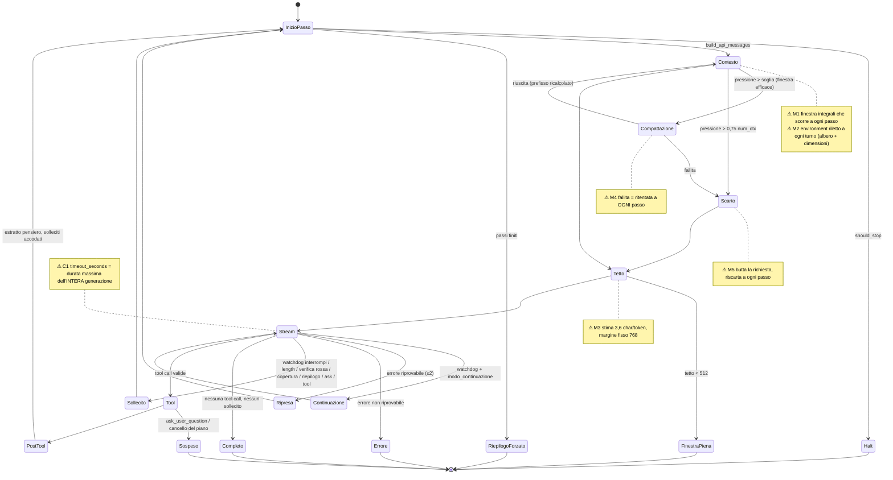

# Audit di Astra — 22 settembre 2026

**Perimetro.** Base: `7a02739` (2.38.1). Correzioni: commit `08be6db` sul ramo `audit-2026-09-22`, non unito a `master`. È un audit **delta**: le correzioni dell'audit del 6 settembre (`AUDIT.md`: protocollo di stream, validazione degli argomenti, retry, persistenza, sicurezza del server) sono state date per buone. Le ho ricontrollate solo dove toccavano le aree che quell'audit non copriva: **riuso del KV cache, budget del contesto, macchina a stati del turno, parametri dell'engine**. Su richiesta dell'utente, la Sezione 3 contiene **patch mirate con test**, non una riscrittura integrale. La Sezione 5 (ricerca sulle tecniche di agent loop e proposte strutturali) è stata aggiunta durante il lavoro.

**Verifiche fatte.** Linux, Python 3.12.14, venv fuori dalla cartella. Suite senza Docker (esclusi `test_sandbox`, `test_anteprima`, `test_schermo_e_terminale`, `test_audit_runtime`), con `test_server` incluso, che su Linux adesso gira.

| | passati | saltati | falliti |
|---|---|---|---|
| prima (`7a02739`) | 1.401 | 1 | 0 |
| dopo (`08be6db`) | 1.467 (66 nuovi in `tests/test_audit_20260922.py`) | 1 | 0 |

`ruff check core server tests scripts`: pulito.

**Verifiche non fatte.** La suite completa su Windows con Docker acceso. Nessuna prova contro il llama-server vero: tutti i numeri sul riuso della cache vengono dalla sonda a secco (`scripts/sonda_prefisso.py`), che misura con la stima dell'harness (3,6 caratteri per token) e non con il tokenizer. Il paragrafo 4.4 dice come misurarli sul server vero; dopo queste patch la misura è registrata a ogni passo.

---

## Sezione 1 — Macchina a stati del turno e criticità

### 1.1 Il ciclo com'è

`run_turn` (`core/agent.py`) è un generatore di ~1.700 righe. La macchina a stati esiste, ma è **implicita**: lo stato vive in una ventina di variabili locali (`nudged`, `leak_nudged`, `summary_requested`, `verify_nudges`, `truncated_nudges`, `watchdog_fires`, `riprese_stream`, `passi_di_servizio`, …) e le transizioni sono catene di `if … continue`. I limiti ci sono tutti: `max_steps`, il budget unico `passi_di_servizio`, un tetto per ogni sollecito. **Non ho trovato cicli infiniti né esecuzioni orfane**; con i fake a disposizione il ciclo termina sempre. I problemi stanno nel costo di ciascun giro.



All'avvio del turno c'è anche un passaggio che il diagramma non mostra: `looks_multi_step(ultima richiesta)` (⚠ **C2**), eseguito prima del primo passo.

### 1.2 Criticità

| ID | Sev. | Dove | Difetto | Stato |
|---|---|---|---|---|
| C1 | 🔴 CRITICAL | `backend._stream_with_retries`, `_request_timeout` | `timeout_seconds` ("Timeout richieste") è la scadenza **totale** della generazione: un passo più lungo di 180 s (default) o 360 s (le tue impostazioni) viene troncato a metà, poi ripreso da capo fino a 2 volte | **corretto** |
| C2 | 🔴 CRITICAL | `agent.artefatti_nominati` (`_ARTEFATTO`) | Backtracking di costo cubico sulle sequenze senza spazi: **31 s a 4.000 caratteri**, ore a 40.000. Scatta all'avvio del turno sulla richiesta dell'utente e tiene il GIL, quindi blocca tutto il server | **corretto** |
| M1 | 🟡 MAJOR | `build_api_messages` (`recent_tools`) | La finestra dei risultati integrali scorre di uno a ogni passo e riscrive un messaggio a metà cronologia: ricalcolati il **50%** dei token già in cache (sonda, 40 passi) | **corretto** (isteresi, −33% con il default; regolabile) |
| M2 | 🟡 MAJOR | `prompts.build_env_header`, `server.start_turn` | Albero del workspace **con le dimensioni dei file** nel primo messaggio di sistema, riletto a ogni turno: basta un file modificato per ricalcolare l'intera conversazione al primo passo del turno dopo | **corretto** (albero fermo + nota delle differenze) |
| M3 | 🟡 MAJOR | `tetto_per_la_finestra`, controllo di sfondamento | Stima 3,6 caratteri per token contro un margine fisso di 768 token: a 60k token un errore del 15% vale 9k. È la stessa famiglia del difetto "chiamata tagliata" del 29/08 | **corretto** sui transport compatibili (calibrazione su `usage.prompt_tokens`); Ollama invariato |
| M4 | 🟡 MAJOR | `run_turn`, ramo compattazione | Una compattazione fallita (riassunto oltre `MAX_TOKEN_RIASSUNTO`, errore del server) viene ritentata **a ogni passo**: una chiamata in più per passo, e su llama-server con un solo slot anche lo spostamento del KV cache | **corretto** (pausa di 3 passi) |
| M5 | 🟡 MAJOR | `drop_oldest_turns` | L'ultima spiaggia butta anche la **richiesta dell'utente** (o il riassunto che la contiene), torna esattamente sulla soglia (quindi riscarta al passo dopo) e aggiunge la nota come `system`, che il filo fonde nel prompt di sistema | **corretto** |
| M6 | 🟡 MAJOR | `LlamaCppBackend._extra_body` | `parallel_tool_calls` non viene inviato: secondo la documentazione di llama.cpp, le chiamate multiple sono "disabled by default", mentre prompt e ciclo le considerano il comportamento giusto | **corretto** (da confermare sulla build: vedi 4.4) |
| M7 | 🟡 MAJOR | `_extra_usage`, `_openai_attempt`, telemetria | `timings.cache_n` / `prompt_n` e `usage.prompt_tokens_details.cached_tokens` venivano scartati: il riuso del prefisso non era misurabile | **corretto** (telemetria + traccia `think` per passo) |
| M8 | 🟡 MAJOR (da misurare) | regia del pensiero → `chat_template_kwargs.reasoning_effort` | Se il template di Qwen3.8 scrive il livello **nel blocco di sistema**, ogni cambio di livello a metà turno ricalcola l'intero prompt. A secco non si può sapere | **sonda pronta**: `sonda_prefisso.py --server` |
| M9 | 🟡 MAJOR (config) | chiamate di servizio (compattazione, estratto del pensiero, riepilogo, delega, vault_search) | Con `-np 1` ogni chiamata di servizio occupa l'unico slot con un altro prompt. Su un modello ibrido (Qwen 3.x 27B) il ritorno alla conversazione può ricalcolare tutto il prompt | proposta S7 + configurazione 4.1 |
| m1 | 🔵 MINOR | `close_remaining` | Lo stop dell'utente chiudeva le chiamate con "il turno è sospeso / attendi la risposta dell'utente": al turno dopo il modello leggeva una frase falsa | **corretto** |
| m2 | 🔵 MINOR | ramo `ask_user_question` senza domanda | Risultato scritto in cronologia senza `ToolFinished`: la tendina restava "in corso" | **corretto** |
| m3 | 🔵 MINOR (sicurezza) | `agent_settings.json` | Chiave OpenRouter in chiaro nella cartella del progetto Claude e nello zip `Agentic harness_v2.35.0.zip`. **Non è in git** (`.gitignore:16`) | segnalato |
| m4 | 🔵 MINOR | `run_turn` | FSM implicita in un solo generatore: le interazioni fra flag si provano solo con turni interi | proposta S3 |

---

## Sezione 2 — Analisi puntuale

I riferimenti di riga sono quelli **dopo** le patch (`08be6db`).

### C1 — Il timeout che tagliava i passi lunghi
**Dove.** `core/backend.py`: `_stream_with_retries` (prima: `deadline = time.monotonic() + timeout_s`), `_request_timeout`, i due `client.stream(...)`.
**Comportamento.** `_checkpoint` alzava `ReadTimeout("Budget temporale della generazione esaurito")` appena superata la scadenza, **anche a metà stream**. Output già emesso, quindi niente retry nel transport. Il ciclo riconosceva "timeout" in `errore_riprovabile` e rifaceva il passo da capo, che veniva tagliato allo stesso punto, per due volte.
**Su un 27B locale.** 6.000 token di pensiero a 25 tok/s fanno 240 s, più il prefill. Un normale passo di pianificazione supera i 180 s di default.
**Soluzione.** `timeout_seconds` diventa ciò che dice l'etichetta, un timeout di **inattività** su ogni lettura (httpx `read`). Il prefill ci rientra, perché llama-server tace finché non ha finito il prompt. Resta un tetto assoluto `DURATA_MAX_GENERAZIONE_S = 3600`. Test: `test_una_generazione_lunga_non_viene_tagliata_dal_timeout`, `test_il_tetto_assoluto_resta`, `test_la_lettura_usa_l_inattivita`.
**Limite noto.** Nel fallback non-streaming di Ollama (versioni < 0.8) l'intera risposta arriva in una sola lettura, quindi lì il timeout resta di fatto totale, come prima.

### C2 — Una parola lunga bloccava il server
**Dove.** `core/agent.py:1335` (`_PAROLA_PERCORSO`), `artefatti_nominati`.
**Comportamento.** In `[\w./-]*\w[\w-]*\.(ext)\b` le due classi si contendono gli stessi caratteri, e `finditer` riparte da ogni posizione. Misurato: 500 caratteri 0,07 s; 1.000 0,51 s; 2.000 3,96 s; 4.000 **31,1 s**. L'ho trovato per caso: un test con una richiesta da 40.000 caratteri non terminava.
**Ripercussione.** Basta incollare nella richiesta una riga di base64, un JS minificato o una riga di log lunga, e il turno non parte. Il `re` di CPython non rilascia il GIL, quindi si fermano anche SSE e UI.
**Soluzione.** La regex si applica **parola per parola** (`[\w./-]+`, tempo lineare), saltando le parole oltre 200 caratteri, che non sono percorsi. Il caso peggiore diventa 5 ms per parola; 400.000 caratteri si leggono in 11 ms. Il risultato sulle frasi normali non cambia (`test_gli_artefatti_si_riconoscono_ancora`). Ho sottoposto a fuzzing le altre euristiche testuali (`looks_like_*`, `strip_tool_wrappers`, `strip_think`, `parse_text_tool_calls`, `errore_riprovabile`, …) su dieci input avversi da 20k caratteri: nessuna supera 0,2 s.

### M1 — La finestra dei risultati integrali
**Dove.** `core/agent.py:427` `risultati_integrali`; `core/config.py:146` `ISTERESI_RISULTATI`; campo `Budgets.tool_result_full_tokens`.
**Comportamento.** `recent_tools = tool_positions[-N:]`. A ogni nuovo risultato, il più vecchio della finestra veniva compattato: si riscriveva un messaggio a N risultati dalla fine, e insieme la potatura degli argomenti del suo `write_file`/`edit_file`. Il commento in `config.py` riconosceva il costo ma lo pagava a ogni passo.
**Misura** (sonda a secco, sessione sintetica da 40 passi con le proporzioni dei tool del 23/08, compattazione non simulata):

| politica | token ricalcolati | token inviati | passi con ricalcolo |
|---|---|---|---|
| prima (finestra che scorre) | ~246.000 | ~492.000 | 37 su 40 |
| isteresi 0,5 (default) | ~165.000 | ~573.000 | 14 |
| isteresi 0,75 | ~121.000 | ~640.000 | 8 |
| isteresi 1 | ~87.000 | ~735.000 | 4 |

Sulla sessione reale da 77 messaggi presente nella cartella: 13.093 token ricalcolati su 201.918, che diventano 0.
**Soluzione.** Il confine fra compattati e integrali resta fermo finché la zona integrale sta in `tool_result_full_tokens` (= quota × `ISTERESI_RISULTATI`), poi salta in un colpo solo agli ultimi N. Il costo conta anche i corpi di `write_file`/`edit_file` che la potatura toglierebbe. L'invariante di `budgets_for` regge: all'invio la zona o sta nella quota o contiene esattamente N risultati (`test_la_zona_integrale_rispetta_la_quota_o_la_finestra`, 39 casi). Senza quota (Budgets costruiti a mano, figlio della delega) il comportamento resta quello di prima.
**Il baratto è reale.** I token ricalcolati costano prefill vero; quelli inviati in più stanno in cache ma avvicinano la soglia di compattazione e, su OpenRouter, si pagano. Ho scelto 0,5 come compromesso; chi lavora solo in locale può alzarla.

### M2 — L'environment che cambiava a ogni turno
**Dove.** `core/prompts.py:155` `aggiornamento_albero`, `build_env_header(albero=…)`; `server/main.py:833` `albero_del_turno`.
**Comportamento.** `build_env_header` metteva nell'`<environment>` il risultato di `workspace_snapshot`, che include `nome (1,234 B)`, e `start_turn` lo ricalcolava a ogni turno (`fresh=True`). `messaggi_per_il_filo` fonde system ed environment in un unico messaggio di sistema. Quindi: il turno scrive un file, al turno dopo l'environment è diverso, e il server ricalcola tutta la conversazione dopo il prompt di sistema.
**Soluzione.** L'albero resta quello letto all'inizio della conversazione (in memoria, per sessione). A ogni turno le differenze (`+` nuovo, `-` rimosso, `~` dimensione cambiata, al massimo 40 righe) si accodano come messaggio `user` nascosto `<aggiornamento_workspace>`, una sola volta e solo se sono cambiate dall'ultima nota. Oltre 40 righe si riscrive l'albero, cioè un ricalcolo, una volta. Il testo dell'environment è stato corretto: prima diceva "letto dal disco adesso", adesso nomina la nota. Dopo un riavvio dell'harness si riparte dall'albero fresco, con un ricalcolo in più e nessun errore.

### M3 — La stima dei token
**Dove.** `core/agent.py:1465` `calibra_stima`, `tetto_per_la_finestra(fattore=)`, `drop_oldest_turns(fattore=)`, e in `run_turn` la variabile `fattore_stima`.
**Soluzione.** A fine stream, sui transport che dichiarano `prompt_tokens_is_total = True` (OpenAI-compatibile, llamacpp, OpenRouter), rapporto fra `usage.prompt_tokens` e la stima della stessa richiesta, limitato fra 1,0 e 2,0. Il fattore corregge il tetto di generazione e il controllo di sfondamento dei passi successivi del turno. **La soglia di compattazione non cambia**, perché è tarata e testata sulla stima. Su Ollama non si calibra: con la cache del prefisso `prompt_eval_count` non è garantito essere il prompt intero. La traccia `think` di ogni passo registra `prompt_stimato`, `prompt_reale`, `cache`, `ricalcolati`, `fattore_stima`.

### M4 — Compattazione fallita a ogni passo
`compattazione_ferma_fino_a = step + PAUSA_COMPATTAZIONE_FALLITA (3)`, conteggiata come `compattazione_rinviata`. Lo sfondamento resta protetto da `drop_oldest_turns`. Test: `test_una_compattazione_fallita_non_si_riprova_a_ogni_passo` (6 passi sopra soglia: prima 6 riassunti falliti, adesso 1 o 2).

### M5 — `drop_oldest_turns`
Tiene l'**ancora**: il primo messaggio della cronologia, se è dell'utente (la richiesta, oppure il riassunto che la contiene). Scende a `soglia − 0,10` invece che alla soglia. Mette la nota come `user` con `[Nota dell'harness]` dopo l'ancora, non più come `system` in testa. Test: `test_lo_scarto_tiene_la_richiesta_dell_utente`, `…non_tocca_il_prompt_di_sistema`, `…scende_sotto_la_soglia`.

### M6, M7 — llama-server
`parallel_tool_calls: true` in `_extra_body`. `cache_n` → `cached_tokens` e `prompt_n` → `prompt_processed_tokens` in `_extra_usage`. `prompt_tokens_details.cached_tokens` letto per tutti i transport compatibili. Il nuovo campo è in `telemetry._USAGE_FIELDS`, e `fine()` riporta i due totali del turno.

### Aree ricontrollate senza difetti nuovi
- Framing SSE/NDJSON, rilascio delle tool call solo dopo `done`/`[DONE]`, retry solo prima del primo byte: invariati dal 6/09 e corretti.
- Solleciti accodati dopo i risultati dei tool, mai in mezzo: verificato su tutti i rami.
- Blocco di coda (piano, note, libreria, vault) come ultimo messaggio `user`: è la scelta giusta per il prefisso; ricalcolato a ogni passo per costruzione.
- `OsservatorePensiero` legge in modo incrementale (finestra sovrapposta di 40/120 caratteri): nessun costo quadratico.
- Parallelismo dei tool: resta sequenziale. Sono d'accordo con la motivazione dell'audit del 6/09 (stato condiviso, cache delle letture). Vedi S6 per l'unico caso in cui converrebbe.

---

## Sezione 3 — Codice

Scelta dell'utente: **patch mirate, suite verde**, nessuna riscrittura. Tutto è nel commit `08be6db`:

```
 core/agent.py                | 317 ++++++++++-----
 core/backend.py              |  66 +++-
 core/config.py               |  30 ++
 core/prompts.py              |  99 ++++-
 core/telemetry.py            |   3 +-
 scripts/sonda_prefisso.py    | 242 ++++++++++++  (nuovo)
 server/main.py               |  71 +++-
 tests/test_audit_20260922.py | 434 ++++++++++++++++  (nuovo, 66 test)
```

Per rivederlo e unirlo:

```powershell
git diff 7a02739 audit-2026-09-22
uv run pytest tests -q            # con Docker acceso, su Windows
git checkout master; git merge audit-2026-09-22
```

Non ho aggiornato versione, README e `CONSEGNA.md`: il numero di versione (2.38.2?) e la voce del README li decidi tu al momento del merge.

**Contratti cambiati di proposito:**
- `timeout_seconds` ora è inattività, non durata massima;
- l'environment non è più "letto adesso": le differenze arrivano come nota nascosta;
- le chiamate chiuse per stop hanno `error_code: turn_stopped`, non più `turn_suspended`;
- `drop_oldest_turns` restituisce la nota come `user`, non come `system`.

---

## Sezione 4 — Configurazione dell'engine

### 4.1 llama-server con Qwen3.8-27B (il setup attuale)

I Qwen 3.x da 27B su llama.cpp sono modelli **ibridi** (attenzione più strati ricorrenti). Il loro stato ricorrente non si "riavvolge" a una posizione qualsiasi: se il prompt diverge, il server può ripartire solo da un *context checkpoint* precedente, e se non ne trova uno valido **ricalcola tutto**. Nel log compare "forcing full prompt re-processing due to lack of cache data (likely due to SWA or hybrid/recurrent memory)". Nell'estate 2026 ci sono issue aperte proprio su Qwen 3.5/3.6 27B (llama.cpp #20225, #22746, #24055). Per Qwen3.8 non l'ho verificato; lo dice il log a verbosità 4. Per questo M1 e M2 pesano più che su un modello ad attenzione piena.

```bash
llama-server -m Qwen3.8-27B-GSQ-RCO-IQ3_S-mtp.gguf \
  --jinja --reasoning-format deepseek --no-context-shift \
  -c 65536 -np 1 \
  -fa on --cache-type-k q8_0 --cache-type-v q8_0 \
  --ctx-checkpoints 64 -cms 2048 --cache-ram 16384 \
  --spec-type draft-mtp          # come ora
# per la diagnosi, temporaneamente:  -lv 4 --log-prompts-dir ./prompts
```

- **`-c 65536` basta.** Con `compact_max_tokens = 32768` la compattazione lavora su una finestra efficace di 43.690 token, e lo scarto scatta a 0,75 × `num_ctx`. Oltre 64k la finestra serve solo se alzi `compact_max_tokens`.
- **`--ctx-checkpoints` / `-cms`** (checkpoint per slot e distanza minima fra checkpoint, default 32 e 8192) e **`--cache-ram`** (default 8192 MiB): più checkpoint e più ravvicinati vogliono dire meno token da ricalcolare dopo una divergenza, al costo di RAM (da 60 a 200 MiB per checkpoint secondo le misure pubblicate). `-cms` è recente (è arrivato con la rimozione di `--checkpoint-every-n-tokens`, maggio 2026): **verifica con `llama-server --help` sulla tua build**.
- **KV `q8_0`**, non `q4_0`: la documentazione del function calling di llama.cpp avverte che le quantizzazioni KV estreme degradano le tool call.
- **`-np 1`** tiene lo stato in un solo slot, ma ogni chiamata di servizio lo occupa (M9, S7).
- **Sampler.** I valori della model card di Qwen3.8 per la modalità thinking. `repeat_penalty 1.0`, come già fa l'harness: penalizzare le ripetizioni rovina identificatori e JSON. **Niente mirostat**: sostituisce top-k/top-p con un controllo di perplessità pensato per la prosa lunga, e su tool call e codice non serve. **Nessuno `stop` personalizzato**: con `--jinja` l'EOS lo gestisce il template, e uno stop su `</tool_call>` o simili taglierebbe proprio le chiamate.
- **`timeout_seconds`** ora misura il silenzio: 180–300 s coprono il prefill di 64k token sopra i 350–400 tok/s.

### 4.2 Ollama
- `OLLAMA_NUM_PARALLEL=1`: con più slot `num_ctx` si moltiplica in memoria.
- `OLLAMA_FLASH_ATTENTION=1`, `OLLAMA_KV_CACHE_TYPE=q8_0`.
- **Non cambiare `num_ctx` fra una richiesta e l'altra**, perché ricarica il modello. L'harness manda sempre lo stesso anche nelle chiamate di servizio, e va bene così.
- `keep_alive` di 30 minuti, già impostato.
- Ollama non vincola le tool call con una grammatica: il JSON malformato viene dal modello, non dal taglio. Lo intercetta la validazione rigorosa dell'audit del 6/09.

### 4.3 Grammatiche e parsing
Con `--jinja` e `tools`, llama-server applica una **grammatica pigra** che si attiva sui token di inizio chiamata, quindi gli argomenti sono vincolati. Il JSON malformato su llama.cpp è quasi sempre una generazione tagliata, come già diagnosticato il 29/08. Una grammatica GBNF scritta dall'harness sopra quella del template non aggiungerebbe niente e rischierebbe di divergere dal formato nativo di Qwen. L'harness fa bene a non farla.

### 4.4 Come misurare adesso
1. **A secco**, sulle sessioni di `D:\Astra\chat_sessions`:
   `uv run python scripts/sonda_prefisso.py chat_sessions\<id>.jsonl --num-ctx 65536`
2. **Contro il server**:
   `uv run python scripts/sonda_prefisso.py chat_sessions\<id>.jsonl --server http://<gpu>:8080`
   Usa `/apply-template` e `/tokenize` e dice (a) se `low`↔`xhigh` divergono vicino al token 0, nel qual caso la regia del pensiero costa un ricalcolo completo a ogni cambio di livello (M8); (b) dove divergono davvero due passi consecutivi.
3. **Nella sessione salvata**: `think.cache` e `think.ricalcolati` per ogni passo. Dentro un turno, `ricalcolati` dovrebbe restare vicino ai soli messaggi nuovi. Se in ogni passo è quasi il prompt intero, il server non trova checkpoint (4.1).
4. **Chiamate multiple**: in una sessione che lo richiede, un passo con 2 o più `read_file` conferma che `parallel_tool_calls` funziona. Con Qwen3.8 se ne erano già viste 10 in un passo il 29/08, quindi la tua build potrebbe non applicare il default.

---

## Sezione 5 — Ricerca: tecniche attuali di agent loop e proposte strutturali

### 5.1 Cosa dice la letteratura recente (2024–2026)

| Filone | Risultato | Dove sta Astra |
|---|---|---|
| **Il KV cache hit rate come metrica** (Manus) | "the single most important metric for a production-stage AI agent"; prefisso stabile, contesto append-only, serializzazione deterministica | Principio già adottato; mancava la **misura**, aggiunta con M7. Le due violazioni principali erano M1 e M2 |
| **Mascherare, non rimuovere i tool** (Manus) | Togliere tool a metà cambia il prefisso; meglio vincolare la scelta in decodifica | Astra toglie `web_search`/`vault_search` a livello di turno, non a metà: va bene |
| **Il file system come memoria ripristinabile** (Manus; Anthropic, "just-in-time") | Si toglie il contenuto e si tiene il riferimento | È già il `deposito` con gli handle |
| **Recitazione degli obiettivi** (Manus: todo.md) | Riscrivere la lista in coda tiene l'obiettivo nell'attenzione recente | È già il piano in coda |
| **Tenere gli errori in contesto** (Manus) | "Erasing failure removes evidence" | Già fatto: i rifiuti tornano come risultati di tool |
| **Observation masking contro riassunto** (JetBrains, NeurIPS 2025 DL4Code) | Nascondere le osservazioni vecchie **dimezza il costo** rispetto all'agente grezzo e costa il 7% in meno del riassunto con LLM, con pari percentuale di successo su SWE-bench Verified; l'ibrido fa −11% | Astra fa entrambe le cose: compatta i risultati, e sopra 32k un riassunto |
| **"Abbiamo smesso di compattare"** (L. Bouchard, 2026) | Con il prompt caching il riassunto riscrive il prefisso e si ripaga a prezzo pieno; tenere tutto costava meno e ricordava di più (92% contro 58%) | Vale per le API con cache scontata; in locale conta il prefill. Vedi S2 |
| **ACE, Agentic Context Engineering** (Stanford, ott. 2025) | Contesti come "playbook" che evolvono per **delta incrementali**, non riscritture: evitano *brevity bias* e *context collapse*; +10,6% su benchmark agentici | La libreria append-only e l'estratto del pensiero vanno in questa direzione; manca il "riflettore" sugli errori (S9) |
| **ACI, Agent-Computer Interface** (SWE-agent, NeurIPS 2024) | Linter che **rifiuta** le modifiche con errori di sintassi; viewer a finestra; ricerca sintetica; messaggio esplicito per i comandi senza output | Astra ha la finestra e la ricerca sintetica; mancano il **linter sulle modifiche** e il messaggio di output vuoto (S5) |
| **Rilevamento dello stallo** (OpenHands StuckDetector) | Stessa azione e osservazione ≥4 volte, stessa azione con errore ≥3, monologo ≥3, **alternanza A-B ≥6 cicli** | Astra copre ripetizione e stallo; manca l'alternanza (S4) |
| **Overthinking** (Cuadron et al., 2025) | Più overthinking vuol dire risultati peggiori; scegliere le traiettorie con meno overthinking dà ~+30% di prestazioni e −43% di calcolo | La regia del pensiero va esattamente qui; il dato conferma che la misura per tipo di punto è quella giusta |
| **CodeAct** (ICML 2024) | Azioni come codice Python eseguibile: fino al +20% di successo su 17 LLM, con meno passi | Possibile tool opzionale (S10) |
| **LLMCompiler** (ICML 2024) | Chiamate pianificate come DAG ed eseguite in parallelo: fino a 3,7× di latenza in meno rispetto a ReAct | Rilevante solo per tool lenti (S6) |
| **Anthropic, context engineering** (2025) | Contesto come risorsa finita ("context rot"), tool minimi e non sovrapposti, sotto-agenti che restituiscono 1–2k token distillati | È già la delega con referto |

### 5.2 Proposte strutturali, in ordine di rapporto fra beneficio e rischio

**S1 — Governare con la metrica di cache (subito, costo zero).** Adesso i dati ci sono: un pannello "cache" per passo (`cache / (cache + ricalcolati)`) e un obiettivo esplicito (≥90% dentro un turno). Ogni modifica futura al contesto va giudicata su quel numero, come si è fatto qui con la sonda.

**S2 — Più masking, meno riassunti.** Con il masking forte già presente, il riassunto con LLM a 32k è il punto in cui si ricalcola tutto il prefisso. Esperimento: `compact_max_tokens` a 48k–64k (con `-c 65536` o `-c 98304`), confrontando sulle stesse sessioni `ricalcolati`, numero di compattazioni ed esito dei punti del piano. La letteratura dice che il masking regge la qualità; va verificato sul 27B.

**S3 — La FSM esplicita, a pezzi.** Senza toccare il generatore:
1. estrarre `StatoTurno` (dataclass con tutti i flag e i contatori);
2. estrarre la cascata "nessuna tool call" (length → verifica rossa → copertura → riepilogo → ask → tool → completo, circa 250 righe) in una funzione pura `decidi_senza_tool(stato, esito) -> Azione`;
3. fare lo stesso per il post-tool (ripetizione, stallo, piano, delega).

Ogni transizione diventa testabile senza un turno intero. Il generatore resta il posto degli `yield` e dei side effect.

**S4 — Alternanza A-B.** Aggiungere a `RipetizioniTool` il riconoscimento del ping-pong (due firme che si alternano per ≥6 passi senza scritture in mezzo). È il caso tipico di un modello piccolo che rilegge due file a turno.

**S5 — ACI più severa (alto valore sugli SLM).**
- Dopo `edit_file`/`write_file` su `.py`, eseguire `ast.parse`; su `.json`, `json.loads`. Se il file prima era valido e dopo non lo è più, **rifiutare la modifica** e restituire riga, colonna e contesto. SWE-agent lo fa e lo misura. Sui file nuovi, avviso invece di rifiuto.
- `run_command` senza output: restituire esplicitamente "comando riuscito, nessun output".

**S6 — Parallelismo mirato.** Non per `read_file` locale, dove il guadagno è nell'ordine dei millisecondi, ma per `web_search`, `vault_search` ed `esplora` nello stesso passo. Esecuzione concorrente con semaforo e risultati ricongiunti per id, perché sono i soli tool che durano secondi.

**S7 — Uno slot per le chiamate di servizio.** Con llama-server `-np 2`, `id_slot: 0` per il turno principale e `id_slot: 1` per compattazione, estratto, riepilogo e delega. La conversazione principale non viene più spostata. Costa memoria KV per il secondo slot, poca su un modello ibrido. Va deciso **dopo** la misura di S1: se `--cache-ram` già ripristina lo stato, non serve.

**S8 — Pensiero conservato dentro il turno.** Con `strip_think_from_context` attivo, al passo dopo l'assistant viene riscritto senza pensiero, cioè diverge dall'output generato. Su un modello ibrido è una divergenza a ogni passo. Da provare: pensiero conservato per i soli passi del turno corrente (è quello che fa il template di Qwen3) più `--reasoning-preserve` sul server, se la build lo ha. Il baratto (più token contro meno ricalcolo) si misura con S1.

**S9 — Riflettore alla ACE.** A fine punto del piano chiuso con verifica rossa o con `ignore_red`: una voce "lezione" per delta nella libreria (cosa non ha funzionato, e perché). Mai riscritture delle voci esistenti.

**S10 — CodeAct opzionale.** Un tool `python` nella sandbox con un piccolo modulo di utilità (leggi, cerca, elenca) per i passi esplorativi composti. Da valutare con cautela: sposta lavoro fuori dalle guardie per singolo tool (`known_files`, verifiche).

**S11 — Journal degli effetti.** Chiude il residuo HIGH dell'audit del 6/09 (exactly-once). Prima di `write_file`/`edit_file`/`run_command`, scrivere nell'intento (percorso, sha prima); dopo, l'esito (sha dopo). Alla ripresa, un'intenzione senza esito si riconcilia confrontando gli hash invece di ripetere l'azione.

### 5.3 Cosa non proporrei
- **Una riscrittura asincrona del ciclo** (asyncio ovunque): il ciclo gira in un worker per conversazione, gli stream sono già ASGI. Il collo di bottiglia è la GPU, non l'event loop.
- **Grammatiche GBNF scritte a mano**: vedi 4.3.
- **Framework a grafo** (LangGraph e simili): la tendenza dei sistemi che funzionano (Claude Code, Manus, OpenHands) è un solo ciclo con tool, piano e sotto-agenti. È l'architettura che Astra ha già.

---

## Nota di sicurezza
`agent_settings.json` contiene una chiave OpenRouter in chiaro. Non è nel repository, ma sta nella cartella del progetto Claude (sincronizzata come contesto) e nello zip `Agentic harness_v2.35.0.zip` (lì c'è un `agent_settings.json`; non ho verificato se la chiave sia la stessa). Se quello zip o la cartella sono mai stati condivisi, conviene revocare la chiave su OpenRouter e crearne una nuova.

## Fonti
- Manus, [Context Engineering for AI Agents: Lessons from Building Manus](https://manus.im/blog/Context-Engineering-for-AI-Agents-Lessons-from-Building-Manus)
- Anthropic, [Effective context engineering for AI agents](https://www.anthropic.com/engineering/effective-context-engineering-for-ai-agents)
- Lindenbauer et al., [The Complexity Trap: Simple Observation Masking Is as Efficient as LLM Summarization](https://arxiv.org/abs/2508.21433)
- L. Bouchard, [Context Engineering in 2026: Why We Stopped Compacting](https://www.louisbouchard.ai/context-engineering-2026/)
- Zhang et al., [Agentic Context Engineering (ACE)](https://arxiv.org/abs/2510.04618)
- Wang et al., [Executable Code Actions Elicit Better LLM Agents (CodeAct)](https://huggingface.co/papers/2402.01030)
- Kim et al., [An LLM Compiler for Parallel Function Calling](https://arxiv.org/abs/2312.04511)
- SWE-agent, [Agent-Computer Interface](https://swe-agent.com/latest/background/aci/)
- OpenHands, [Stuck Detector](https://docs.openhands.dev/sdk/guides/agent-stuck-detector)
- Cuadron et al., [The Danger of Overthinking](https://arxiv.org/abs/2502.08235v1)
- llama.cpp, [server README](https://github.com/ggml-org/llama.cpp/blob/master/tools/server/README.md) e [function calling](https://github.com/ggml-org/llama.cpp/blob/master/docs/function-calling.md)
- llama.cpp issue [#22746](https://github.com/ggml-org/llama.cpp/issues/22746), [#24055](https://github.com/ggml-org/llama.cpp/issues/24055), [#20225](https://github.com/ggml-org/llama.cpp/issues/20225)
- Particula, [Full Prompt Re-Processing: llama.cpp Cache Fixes](https://particula.tech/blog/prompt-reprocessing-swa-hybrid-models-kv-cache)
