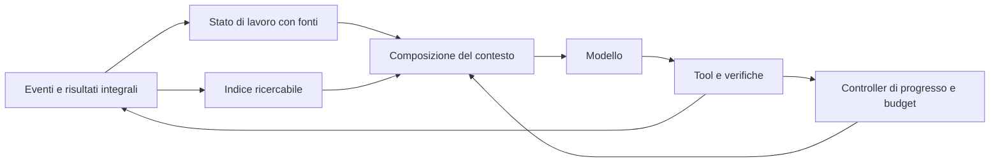

# Astra: loop agentico e conservazione del contesto

Aggiornamento del 14 settembre: i fix applicati e le nuove verifiche sono in
[Implementazione 2.37.0](IMPLEMENTAZIONE_LOOP_CONTESTO_2026-09-14.md).
Questa analisi conserva la fotografia del runtime precedente alle modifiche.

Analisi conclusa il 12 settembre 2026 sul codice 2.36.1 in `D:\Astra`. Obiettivo: aumentare il successo dei compiti e ridurre tempo e lavoro ripetuto, su finestre piccole e grandi. Questa è una proposta: il runtime non è stato modificato.

**La direzione consigliata è un contesto di lavoro selettivo e verificabile, costruito da uno stato persistente, con un controller che assegna ragionamento e recuperi in base al lavoro rimasto.** Astra possiede già molti dei componenti necessari. Prima di aggiungere nuovi agenti, conviene rendere affidabile il percorso che porta dalle evidenze salvate alla successiva decisione del modello.

Distinguo tre dimensioni: durata del compito, dimensione della finestra e capacità del modello. Un 8B con 128k disponibili può comunque aver bisogno di un contesto operativo molto più corto; un modello grande può ricevere un compito semplice che non giustifica pianificazione o delega.

**1. Evidenze locali e limiti dell'indagine**

Ho letto implementazione e test di contesto, compattazione, memoria, note, libreria, deposito, loop, delega, backend e persistenza. Ho eseguito cinque sonde sintetiche senza chiamare modelli: sono riproducibili con [context_probes.py](D:/Astra/docs/research/context_probes.py). I risultati, con hash dei sorgenti esaminati, sono in [context_probes.json](D:/Astra/docs/research/context_probes.json).

Le sonde dimostrano comportamenti del software, non un aumento o una diminuzione misurata del solve rate. Le misure storiche nei commenti del repository sono indizi: non le considero benchmark ripetuti in questa analisi.

Nel bundle `artifacts/Astra/chat_sessions` sono disponibili 69 conversazioni e 5.798 messaggi. Mancano il modello in 38 conversazioni e i contatori `usage` nelle sessioni esaminate. Questo materiale è utile per ricavare casi reali; non consente di attribuire causalmente differenze di prestazione a un modello o a una politica di contesto.

| Aspetto | Evidenza nel codice o nelle sonde | Implicazione |
|---|---|---|
| Base già valida | Vista API distinta dalla cronologia; raggruppamento di chiamate e risultati; piano e note persistenti; deposito e libreria; prefisso stabile. [agent.py](D:/Astra/core/agent.py:445) | Conservare questi invarianti. Non serve riscrivere tutto il loop. |
| Costo fisso | Stime correnti: prompt snello 1.199 token, schemi snelli completi 3.590; senza vault, prompt + schemi = 4.598. [prompts.py](D:/Astra/core/prompts.py:486) | Circa il 56% di 8.192 token, prima di ambiente, stato, cronologia e output. Sono stime caratteri/token, non un conteggio del template reale. |
| Riferimenti persi | La potatura dei risultati vecchi scarta `deposito`, `stdout_deposito` e `stderr_deposito`. Sonda: tutti assenti dopo la trasformazione. [agent.py](D:/Astra/core/agent.py:374) | Il testo integrale può essere ancora su disco, ma il collegamento diretto scompare. Anche un puntatore incorporato nel mezzo dello stdout può essere tagliato. |
| Scrittura fallita | Una vecchia `write_file` fallita viene potata con un messaggio che dice che il corpo è già su disco. Riprodotto. [agent.py](D:/Astra/core/agent.py:398) | La cronologia API può presentare una falsa indicazione di recuperabilità. Inoltre un file scritto con successo e poi cambiato non equivale alla sua versione storica. |
| Doppio troncamento | Un risultato recente con 11.000 caratteri di contenuto passa da 11.041 a 6.026 caratteri; il testo JSON risultante non è più decodificabile. [agent.py](D:/Astra/core/agent.py:346) | `read_file` e busta del risultato hanno budget diversi. La stringa è comunque lecita come contenuto di un messaggio API: il problema è la perdita della struttura, non un errore HTTP dimostrato. |
| Compattazioni successive | `vecchi = ui_messages[:cut]` riparte dall'origine. Alla seconda compattazione il marcatore di un evento già archiviato torna nel prompt del riassuntore; input 1.816 → 4.025 caratteri nel caso sintetico. [agent.py](D:/Astra/core/agent.py:800) | Si rielaborano vecchi eventi. Escludere il messaggio del riassunto precedente non basta se rientrano gli eventi originali che lo precedevano. Crescono lavoro, duplicazioni e rischio di tagliare fatti utili. |
| Recupero limitato | Il precarico confronta parole della query soltanto con i titoli, prende al massimo due voci e 3.000 caratteri. Una parola presente solo nel corpo non recupera nulla. [libreria.py](D:/Astra/core/libreria.py:301) | La conservazione su disco non equivale a memoria utilizzabile. I titoli possono inoltre derivare dalla stessa prima richiesta nelle compattazioni cumulative. |
| Thinking non trasmesso | Il payload OpenAI-compatible non serializza `params.think`; l'adapter llama.cpp non aggiunge il controllo. [backend.py](D:/Astra/core/backend.py:1068), [adapter llama.cpp](D:/Astra/core/backend.py:1349) | Il livello richiesto e registrato dall'harness può non essere quello applicato. Vale anche per `think=False` delle chiamate ausiliarie. |
| Metriche incomplete | Uso aggregato nel loop, ma non persistito fra i metadati della sessione; compattazione e altre chiamate di servizio non confluiscono interamente nel totale del padre. [session.py](D:/Astra/core/session.py:283), [compaction.py](D:/Astra/core/compaction.py:327) | Un cambiamento può sembrare economico perché parte della sua spesa non viene contata. |

Un ulteriore caso da coprire riguarda il watchdog: può interrompere lo stream anche quando il budget dei recuperi è esaurito, mentre il ramo che gestisce l'interruzione richiede budget disponibile. La soglia viene inoltre calcolata sul budget iniziale, prima del limite imposto dallo spazio residuo. È un percorso individuato staticamente, non riprodotto con un modello reale. [Interruzione](D:/Astra/core/agent.py:2220), [gestione](D:/Astra/core/agent.py:2329), [budget](D:/Astra/core/agent.py:2121).

**2. La proposta per Astra**

Il registro conserva ciò che è successo. Lo stato di lavoro conserva ciò che serve per continuare. Il contesto inviato contiene la porzione utile alla prossima decisione. Queste tre rappresentazioni devono avere responsabilità distinte e collegamenti verificabili.

**A. Rendere reversibile la riduzione del contesto — prima priorità.**

Ogni risultato dovrebbe avere una busta stabile: identificatore dell'evento, tool, esito, percorso del contenuto integrale, intervalli disponibili e versione/hash quando rilevante. La riduzione taglia solo il corpo. Conserva sempre errori aperti, riferimenti e metadati necessari per recuperare l'evidenza.

Per le scritture: distinguere tentativo, esecuzione riuscita e versione corrente del file. Potare un tentativo fallito non deve trasformarlo in lavoro completato. Per gli output lunghi: troncare i campi prima della serializzazione, evitando di spezzare la busta JSON.

Il deposito può avere un limite di spazio, ma i riferimenti necessari ai task attivi vanno protetti dalla pulizia. Per quelli scaduti serve uno stato esplicito. La recuperabilità deve essere una proprietà controllata dal software.

**B. Compattare soltanto il nuovo tratto e verificare il passaggio di stato.**

Introdurre un cursore dell'ultimo evento incorporato, separato dall'indice dei messaggi UI. La nuova compattazione prende il delta successivo al cursore, più lo stato ancora aperto. Il registro completo resta disponibile tramite ricerca per sessione ed evento.

Le richieste originali restano integrali nell'archivio. Nel contesto operativo manteniamo obiettivo attivo, vincoli ancora validi e riferimenti ai messaggi che li hanno introdotti o corretti. Una nuova istruzione può sostituire una precedente: copiarle tutte indefinitamente preserva il testo ma non chiarisce quale valga adesso.

Il passaggio alla nuova vista avviene solo dopo il controllo di invarianti: obiettivo, vincoli attivi, lavoro incompleto, errori irrisolti e fonti devono essere rappresentati. Se il controllo fallisce, mantenere il tratto necessario o usare un fallback deterministico. La soglia di 700 token per il riassunto è un'impostazione, non una garanzia di fedeltà.

**C. Memoria strutturata con provenienza e recupero sul contenuto.**

Evolvere note e libreria verso record atomici: `id`, tipo, testo, fonte, ambito, versione, stato e relazione con eventuali fatti sostituiti. Tipi utili: vincolo dell'utente, osservazione verificata, decisione, ipotesi, tentativo fallito, verifica aperta. Il ragionamento distillato non diventa automaticamente un fatto verificato.

Per iniziare basta un indice lessicale sul corpo — per esempio SQLite FTS5 — con boost a percorsi, simboli e identificatori. Unire ricerca su testo originale e fatti estratti, deduplicare e comporre un pacchetto entro budget. Provare embeddings e reranking soltanto se il benchmark mostra lacune lessicali o semantiche; filtri temporali troppo aggressivi possono eliminare il fatto corretto.

Il recupero si aggiorna al cambio di obiettivo, a un errore rilevante e dopo una compattazione. Non occorre un'altra inferenza a ogni passo. Per i fatti critici, una piccola porzione resta sempre presente; per gli altri, titolo, breve estratto e fonte espandibile.

**D. Sul piccolo contesto, ridurre il costo della scelta degli strumenti.**

Il blocco più costoso è lo schema dei tool. Selezionare un insieme iniziale coerente con il compito: lettura/ricerca, modifica/verifica, produzione di un artefatto. Rendere scopribili gli strumenti ulteriori e conservare accessibile il canale per chiedere informazioni quando serve.

Gli schemi selezionati dovrebbero restare stabili durante una fase, per non invalidare continuamente il prefisso. Accorciare descrizioni o rimuovere strumenti senza misurare la correttezza può penalizzare proprio i modelli piccoli. L'obiettivo è meno ambiguità e meno costo fisso, non il prompt più breve in assoluto.

Portare fuori dal prompt le operazioni deterministiche: ricerche aggregate, metadati, conteggi e raccolta di risultati indipendenti. Il batch di tool già supportato riduce i passaggi al modello; il dispatch attuale è seriale. Parallelizzare solo operazioni indipendenti, dopo una verifica degli effetti e con un limite di concorrenza.

**E. Controller del ragionamento basato sulla fase e sull'evidenza.**

Prima correggere gli adapter: capability del modello/template/backend, parametro effettivamente inviato e supporto verificato vanno distinti dal livello desiderato. Le API locali hanno convenzioni diverse; la compatibilità HTTP non implica compatibilità del controllo del pensiero. [Ollama thinking](https://docs.ollama.com/capabilities/thinking), [llama.cpp server](https://github.com/ggml-org/llama.cpp/blob/master/tools/server/README.md).

Poi sostituire il solo decremento per numero di passo con quattro situazioni: nuova decisione, esecuzione ordinaria, errore/contraddizione, verifica conclusiva. Una nuova difficoltà al passo 12 deve poter ottenere più ragionamento di una lettura meccanica al passo 2.

Assegnare un budget effettivo che includa input, schemi, output atteso e margine. Usare il limite nativo del ragionamento dove supportato; il watchdog dell'harness resta una difesa finale con uno stato di uscita esplicito. Aggiungere limiti complessivi in secondi e token, oltre ai passi.

Un segnale di progresso può combinare nuove evidenze, modifiche rilevanti e verifiche risolte. Ripetere lo stesso comando con lo stesso esito e senza cambiamenti non equivale a progresso. Un solo recupero può aggiornare query, contesto o approccio; un altro sollecito identico spesso aggiunge soltanto costo. È una proposta da validare, non una regola universalmente dimostrata.

**F. Compattazione e manutenzione compatibili con la cache.**

Confrontare la potatura continua attuale con riduzioni per blocchi e ai confini di una fase. Nel secondo caso la cronologia rimane stabile più a lungo, e si paga una riscrittura più rara. Restano necessari limiti per la pressione e per il rumore: rimandare sempre la compattazione può peggiorare la qualità.

Il prefisso stabile accelera il prefill, non la generazione dei nuovi token: se domina il ragionamento, una cache migliore non risolve la lentezza. La documentazione vLLM esplicita questa distinzione. [Automatic Prefix Caching](https://docs.vllm.ai/en/stable/features/automatic_prefix_caching/).

La distillazione del pensiero oggi avviene sincronicamente alla chiusura dei punti. Registrare subito fatti e riferimenti essenziali; accorpare o differire il consolidamento utile solo a sessioni future. L'asincronia sulla stessa GPU non crea capacità aggiuntiva e una chiamata ausiliaria può interferire con la cache del padre: misurare entrambi gli effetti.

**G. Deleghe con contratto di uscita e costo esplicito.**

Il figlio attuale usa lo stesso backend/modello, una finestra nominale maggiore, sei passi e un referto di 2.000 caratteri. Preferire un contratto che richieda risposta, evidenze `file:riga`, incognite e percorso del risultato completo, con un passo riservato alla restituzione. [delega.py](D:/Astra/core/delega.py:110).

Prima della delega scegliere tra ricerca deterministica, agente esplorativo e modello principale. L'isolamento del contesto è utile anche senza esecuzione parallela. Un secondo modello piccolo è conveniente soltanto se la sua qualità e il costo di residenza/caricamento lo giustificano. Il parallelismo d'inferenza va provato sulle risorse reali.

Una verifica indipendente serve soprattutto sui cambiamenti complessi e deve leggere artefatti e risultati dei tool, non limitarsi al resoconto dell'esecutore. Non occorre un revisore LLM per ogni chiamata.

**3. Metodi recenti da cui prendere il contributo utile**

Le applicazioni proposte sopra sono adattamenti per Astra, non repliche già validate dei lavori seguenti.

| Metodo e fonte primaria | Evidenza e limite | Uso consigliato |
|---|---|---|
| [The Complexity Trap, v3, 27 ottobre 2025](https://arxiv.org/html/2508.21433v3) | Su 500 task SWE-bench Verified, Qwen3-Coder 480B passa da $1,29 a $0,61 per task con observation masking; solve rate 53,4% → 54,8%. Altre configurazioni mostrano regressioni: Gemini thinking 40,4% → 36,4%. | Potatura recuperabile come baseline seria. Il tuo harness già ne adotta una forma. Il costo API non predice direttamente la latenza locale. |
| [ACE, v3, 29 marzo 2026](https://arxiv.org/html/2510.04618v3) | Memoria come manuale aggiornato per incrementi. Nell'ablation AppWorld con DeepSeek-V3.1, la media TGC/SGC è 53,3 per ReAct, 56,9 senza aggiornamenti incrementali, 70,3 con essi. Non è una prova su 8B. | Apprendere lezioni da risultati verificati; aggiornare record identificati, senza riscrivere tutta la memoria. Recuperare poche lezioni pertinenti. |
| [Recursive Language Models, v3, 11 maggio 2026](https://arxiv.org/html/2512.24601v3) | Contesto esterno esplorato tramite programmi e sottochiamate. Include Qwen3-8B addestrato con 1.000 esempi, 48 H100-ore e un miglioramento mediano riportato del 28,3% sui task valutati. Il modello base nello stesso scaffold fatica. | Percorso specialistico per corpus, log e analisi che richiedono aggregare molte porzioni. Non è un miglioramento automatico ottenibile aggiungendo una REPL al modello base. |
| [LongMemEval, v2, 4 marzo 2025](https://arxiv.org/html/2410.10813v2) | 500 domande su memoria, ragionamento multisessione, temporalità, aggiornamenti e astensione. Distingue indicizzazione, retrieval e lettura. È QA, non verifica di azioni nell'ambiente. | Separare metriche di recupero delle fonti e capacità di usarle; inserire correzioni di fatti e richieste cui non si può rispondere dai dati. |
| [Anthropic, harness per sviluppo prolungato, 24 marzo 2026](https://www.anthropic.com/engineering/harness-design-long-running-apps) | Descrive planner, esecutore e valutatore con contratti verificabili. I reset utili con Sonnet 4.5 sono stati rimossi per Opus 4.5. È evidenza ingegneristica specifica, non una comparazione universale. | Verifica indipendente e passaggi di stato controllati. Reset e numero di agenti dipendono dal modello e dal task. |

Il filone più sperimentale che proverei è RLM, come modalità separata con limiti di profondità, chiamate, output e tempo. Per il loop ordinario proverei prima gli interventi A–F. Il filone ACE diventa interessante dopo aver raccolto esiti affidabili: apprendere da resoconti imprecisi rischia di rendere persistenti gli errori.

**4. Configurazioni da confrontare, senza confondere finestra e memoria**

| Scenario | Assetto iniziale da sperimentare | Cosa misurare |
|---|---|---|
| Compito breve, 8k–16k | Schemi selezionati, stato minimo, poche letture mirate, nessuna manutenzione LLM superflua | Prima azione corretta, errori di tool calling, successo, tempo totale |
| Compito lungo su modello piccolo | Micro-obiettivi verificabili, stato esplicito, evidenze selezionate, recuperi guidati dai risultati | Vincoli conservati, lavoro ripetuto dopo compattazione, qualità del recupero |
| Compito lungo, 32k–128k disponibili | Più evidenza pertinente e coda stabile; compattazione per fasi e sotto pressione | Qualità a 16k/32k/64k operativi, prefill, latenza complessiva, regressioni |
| Analisi di corpus oltre la finestra | Retrieval per domande locali; elaborazione programmabile/RLM per aggregazioni distribuite | Copertura dei documenti, correttezza delle aggregazioni, chiamate e tempo |

Questi intervalli sono condizioni sperimentali, non valori ottimali dichiarati. Con il tetto attuale di 32.768 token, finestre nominali 64k e 128k usano la stessa finestra efficace di circa 43.690 token per diversi budget. Per studiare davvero il grande contesto occorre variare anche questa politica. [config.py](D:/Astra/core/config.py:130).

Un conteggio del tokenizer sul template serializzato, quando disponibile, deve includere schemi, immagini e riserva d'uscita. Dove non disponibile, calibrare lo stimatore con i contatori osservati e un margine prudente. Oggi `textutils` usa 3,6 caratteri/token mentre un helper in `config` ne usa 4: il margine non è uniforme.

**5. Come decidere se il miglioramento è reale**

Prima salvare per ogni chiamata modello/versione, backend/template, configurazione effettiva, input reale o stimato, token di output, tempi, motivo della chiamata e relazione padre/figlio. Includere riassunti, estratti, retry e deleghe. Registrare un wall-clock completo dell'harness: `total_ms` di Ollama e quello ricostruito da llama.cpp non hanno oggi lo stesso significato.

Costruire 24 casi congelati: otto brevi, otto medi, otto lunghi con almeno due compattazioni o riprese. Ricavarli da casi reali, mantenendo ambienti ripristinabili e verifiche indipendenti. Includere una richiesta corretta a metà lavoro, un errore già risolto da non ripetere, un dettaglio nel mezzo di un log, un fatto divenuto obsoleto e un'informazione assente.

Fare prima screening su sei casi. Per la variante promettente: due modelli rappresentativi, baseline contro una modifica alla volta, tre ripetizioni per caso — 288 esecuzioni nel confronto completo. Le lunghezze fanno parte dei casi, evitando un prodotto cartesiano indiscriminato. Separare cache fredda e calda; alternare l'ordine delle condizioni e congelare la memoria iniziale per evitare contaminazione tra prove.

La metrica primaria è il successo verificato del compito con i vincoli rispettati. Poi: tempo e token complessivi per compito riuscito, costo dei fallimenti, latenza mediana e di coda, prima azione utile, lavoro ripetuto, errori di protocollo e false conclusioni. Per il retrieval misurare sia la presenza della fonte necessaria sia il suo uso corretto nella decisione.

Riportare risultati accoppiati e incertezza per task. Con 24 casi, anche tre ripetizioni non dimostrano piccoli miglioramenti universali; servono soprattutto per scoprire regressioni concrete. Estendere il campione se la differenza osservata è vicina al rumore. I test unitari attuali restano necessari ma non sostituiscono questo benchmark.

**Ordine di lavoro proposto**

1. **Fondamenta:** telemetria persistente completa; buste e riferimenti; scritture fallite; cursore di compattazione; controllo thinking trasmesso e watchdog coerente. Interventi circoscritti, con regressioni deterministiche riproducibili.
2. **Prestazioni ordinarie:** selezione stabile degli schemi; retrieval sul contenuto; stato di lavoro con fonti; controller per fase; confronto fra potatura continua e per blocchi. Abilitazione per modello dopo confronto con la baseline.
3. **Sperimentazione:** memoria procedurale incrementale ACE, routing dei delegati e modalità RLM per corpus grandi. Adottare solo dove il beneficio misurato ripaga complessità e manutenzione.

La prima implementazione che consiglierei è il pacchetto di fondamenta, seguito da un confronto separato tra schemi selettivi sul piccolo contesto e stato/recupero sul contesto lungo. Le sonde locali indicano dove intervenire; i miglioramenti percentuali su Astra restano da misurare.
